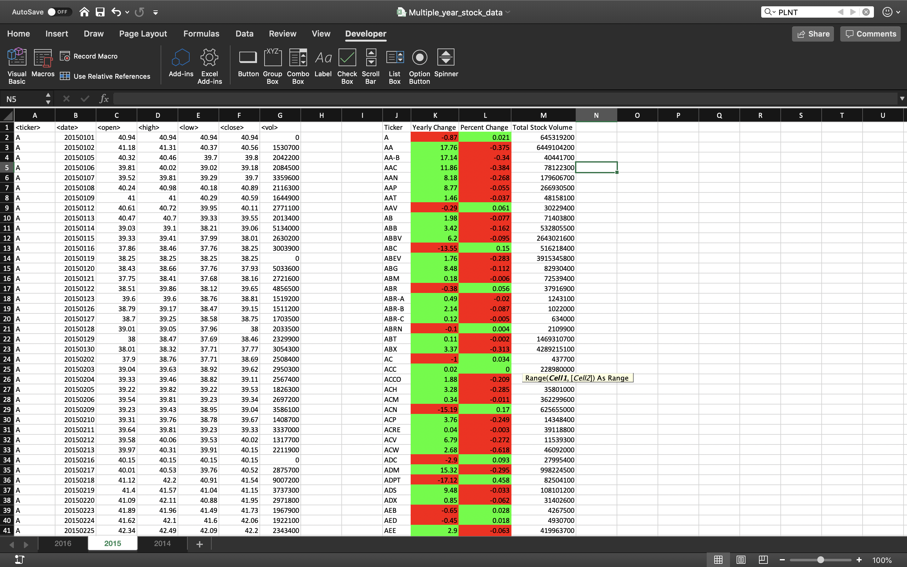
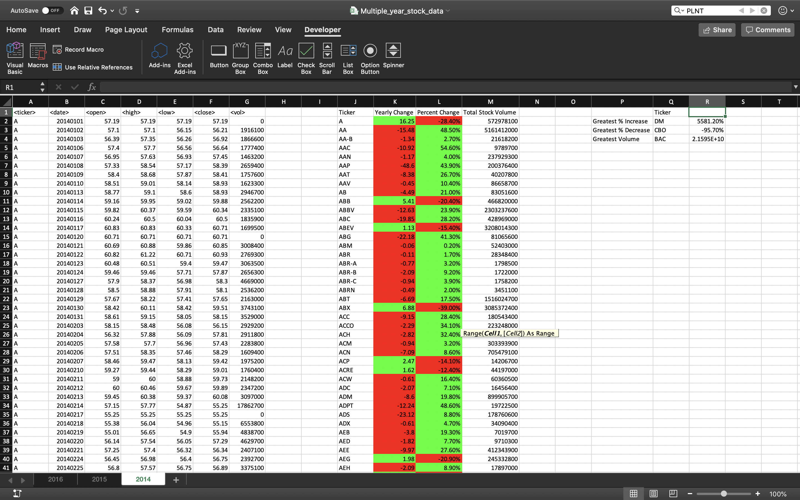

# VBA Homework - VBA of Wall Street
In this workbook, VBA code was used to summarize long excel sheets. Each sheet has approx. 750-800k entries across different stocks. A macro was created to summarize the yearly change, percent change, total stock volume, greatest % increase/decrease, and greatest volume sold. 

_Formulas_
* yearly change: opening price at a year minus closing price at end of year
* percent change: (closing price at end of year - opening price at begining of year) / (closing price at end of year)
* total stock volume: sum of volume over all days that stock was on the stock exchange
* greatest % increase: maximum of percent change
* greatest % decrease: minimum of percent change
* greatest volume sold: maximum of total stock volume

## Screenshots of macro applied to stock data

### 2016 Stock Data

### 2015 Stock Data

### 2014 Stock Data

#### Macro
        Sub stock_summary()

        Dim NumRows As Long
        ' Determine # of rows in  worksheet
        NumRows = Range("A1", Range("A2").End(xlDown)).Rows.Count

        ' Variables used in loop for indexing rows and outputs
        Dim row_counter As Long
        Dim output_row As Integer ' Not anticipating as many rows, may have to switch to long
        ' Variables used to calculate stock questions
        Dim yearly_change As Double
        Dim percent_change As Double
        Dim starting_row As Long
        Dim volume As Long
        volume = 0

        ' Pre-allocate variables before looping through all rows
        output_row = 2 ' Pre-allocate output row
        starting_row = 2 ' Define starting row, allowing us to capture changes over the ticker

        ' Format output
        Range("J1") = "Ticker"
        Range("K1") = "Yearly Change"
        Range("L1") = "Percent Change"
        Range("M1") = "Total Stock Volume"

        ' Loop through all rows to determine stock summary statistics
        For row_counter = 2 To NumRows

        ' add volume
        ' volume = volume + Cells(row_counter, 7)

            If Cells(row_counter + 1, 1).Value <> Cells(row_counter, 1).Value Then

                ' Ticker symbol
                Cells(output_row, 10) = Cells(row_counter, 1)

                ' Calculate Yearly change = opening price at begining to closing price at end
                yearly_change = Cells(starting_row, 3) - Cells(row_counter, 6)
                Cells(output_row, 11) = yearly_change

                ' Conditional formatting for yearly change - if positive: green, if negative: red
                If yearly_change >= 0 Then
                    Cells(output_row, 11).Interior.ColorIndex = 4
                Else
                    Cells(output_row, 11).Interior.ColorIndex = 3
                End If

                ' Calculate percent change = opening price at begining to closing price at end

                If Cells(row_counter, 3) = 0 Then
                    Cells(output_row, 12) = 0
                    Cells(output_row, 12).Interior.ColorIndex = 7
                Else
                     percent_change = Round((-1 * (Cells(starting_row, 3) - Cells(row_counter, 6)) / Cells(starting_row, 3)), 3)
                    Cells(output_row, 12) = percent_change

                End If

                ' Conditional formatting for percent change - if positive: green, if negative: red
                If percent_change >= 0 Then
                    Cells(output_row, 12).Interior.ColorIndex = 4
                Else
                    Cells(output_row, 12).Interior.ColorIndex = 3
                End If

                ' Calculate total volume
                Cells(output_row, 13) = Application.Sum(Range(Cells(starting_row, 7), Cells(row_counter, 7)))

                ' Increment output row counter
                output_row = output_row + 1
                starting_row = row_counter + 1 ' index begining of next stock at the next row

            End If

        Next row_counter

        ' Format output
        Columns("L").NumberFormat = "0.00%"

        ' Once summary table is made, complete Challenges section
        ' parse through columns and pull maximum and minimum of % change, and max total volum

        ' Calculate number of rows in summary table
        NumRows = Range("K2", Range("K3").End(xlDown)).Rows.Count

        ' output titles
        Cells(2, 16) = "Greatest % Increase"
        Cells(3, 16) = "Greatest % Decrease"
        Cells(4, 16) = "Greatest Volume"
        Cells(1, 17) = "Ticker"

        ' Calculate maximum % increase
        Cells(2, 18) = Application.WorksheetFunction.Max(Range(Cells(2, 12), Cells(NumRows + 1, 12)))
        Cells(2, 18).NumberFormat = "0.00%"
        ' Calculate Maximum % decrease
        Cells(3, 18) = Application.WorksheetFunction.Min(Range(Cells(2, 12), Cells(NumRows + 1, 12)))
        Cells(3, 18).NumberFormat = "0.00%"
        ' Calculate greatest total volume
        Cells(4, 18) = Application.WorksheetFunction.Max(Range(Cells(2, 13), Cells(NumRows + 1, 13)))

        Dim row_summary As Long

        ' Loop through summary table to format tickers
        For row_summary = 2 To NumRows
            If Cells(row_summary, 12) = Range("R2") Then
                Range("Q2") = Cells(row_summary, 10)
            End If

            If Cells(row_summary, 12) = Range("R3") Then
                Range("Q3") = Cells(row_summary, 10)
            End If

            If Cells(row_summary, 13) = Range("R4") Then
                Range("Q4") = Cells(row_summary, 10)
            End If

        Next row_summary

        End Sub

